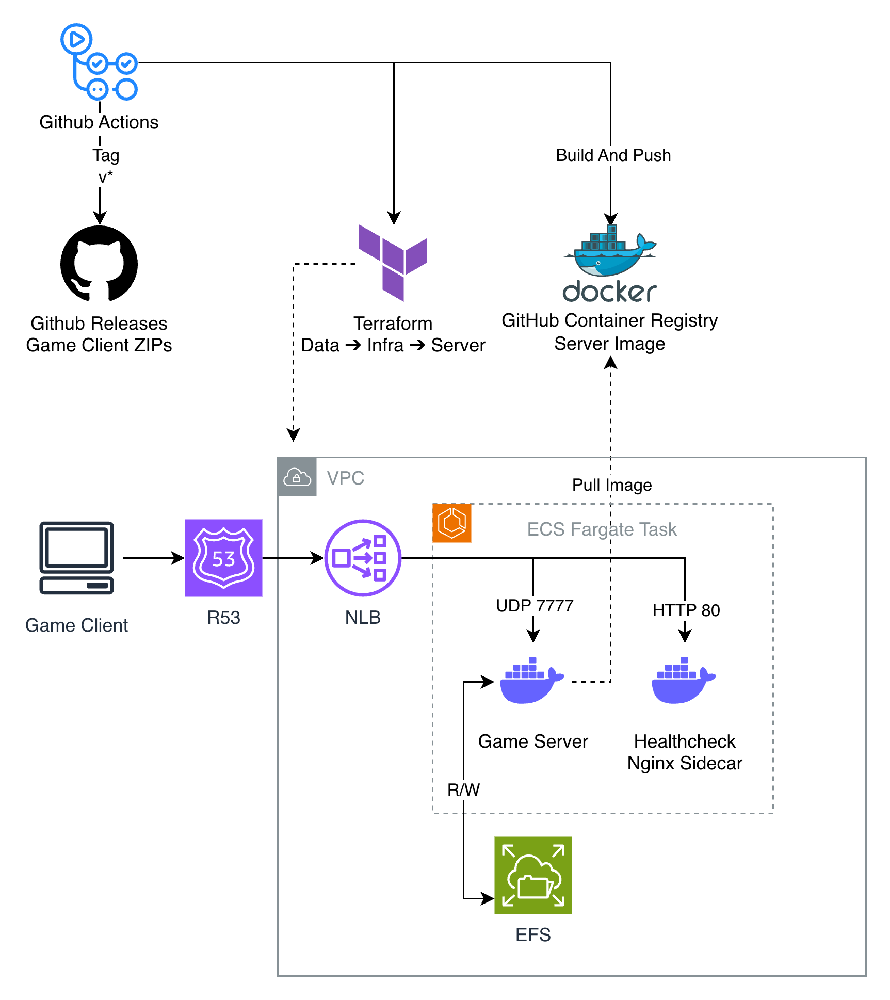

# Fun Run: Multiplayer Game & Cloud Infrastructure


Fun Run is a 2D multiplayer racing game built in Unity using Mirror Networking, inspired by the classic mobile title. 

This repository contains the game client, server, and the infrastructure-as-code required to host it on AWS. The cloud environment is provisioned entirely via Terraform, with automated Docker builds and deployments managed through a GitHub Actions CI/CD pipeline.


---

## Gameplay Preview


---

## Architecture

*(The diagram below illustrates the production environment, highlighting the separation of infrastructure, application, and data layers, along with the GitOps deployment flow).*




---


## Repository Structure

The repository is organized to separate application logic, containerization, and infrastructure provisioning.

```text
├── .github/workflows/      # CI/CD pipelines
├── Assets/                 # Unity client and server source code
├── docker/Linux/           # Server Dockerfile
└── terraform/              # Infrastructure as Code
    ├── bootstrap/          # State backend provisioning
    ├── live/               # Environment states (dev, prod)
    │   ├── data/           # Stateful resources 
    │   ├── infrastructure/ # Base infrastructure
    │   └── server/         # Server layer
    └── modules/            # Reusable AWS components
```

**Engine Requirement:**
* Unity Editor `6000.2.8f1` (requires the Linux Dedicated Server build module)

---

## Running the Client

**[Download the Latest Release Here](https://github.com/sofgiman/Fun-Run/releases/latest)**

> **Solo Testing:** The game requires exactly 2 players to begin. If the server lobby is empty, you can simply launch the game application twice on your computer to connect a second client and trigger the game.
<details>
<summary><b>Windows</b></summary>

1. Extract the downloaded ZIP folder.
2. Run `Fun Run.exe`.
3. **Note:** If Windows shows a "Windows protected your PC" prompt, click **More info** and select **Run anyway**. (This is standard behavior for indie games without a commercial publisher certificate).</details>

<details>
<summary><b>Mac</b></summary>
  
1. Extract the downloaded ZIP folder.
2. **Note:** Since this is an independent project without a paid Apple Developer certificate, double-clicking might not work. Instead, **Right-Click** the `Fun Run.app` file and select **Open**.
3.  **Troubleshooting:** If macOS displays an "app is damaged" warning, open your terminal and run the following command to clear the quarantine flag:
    ```bash
    xattr -cr /path/to/extracted/"Fun Run.app"
    ```
</details>

<details>
<summary><b>Linux</b></summary>

1. Extract the downloaded ZIP folder.
2. Open your terminal, navigate to the extracted folder, and grant execution permissions:
   ```bash
   chmod +x "Fun Run"
   ```
3. Launch the game
   ```bash
   ./"Fun Run"
   ```
</details>

---

## Cloud Infrastructure

An overview of the core infrastructure and engineering choices powering the backend:

* **Compute:** The Unity server runs as a Docker container on AWS ECS Fargate. This provides a serverless compute layer, and the container is configured with a read-only root filesystem for added security.
* **Networking:** UDP game traffic is routed through a Network Load Balancer (NLB), which natively supports the connectionless protocol required for multiplayer synchronization.
* **Health Checks (Sidecar Pattern):** Because the UDP game server does not respond to standard AWS TCP health checks, the ECS task includes a lightweight Nginx sidecar container. Its only job is to return healthy HTTP statuses to the NLB to keep the target group active.
* **State Management:** User credentials are stored in an SQLite database. To maintain an ephemeral compute layer, this database resides on an Amazon EFS volume mounted to the ECS task at runtime.
* **Infrastructure as Code:** The environment is provisioned using Terraform. The project is separated into logical layers (`bootstrap`, `data`, `infrastructure`, `server`), utilizing S3 remote backends and DynamoDB state locking.

---

## CI/CD Pipeline

Integration and deployment are automated via GitHub Actions using isolated workflows and reusable templates.

* **Environment Strategy:** Development workflows execute on pushes to the `dev` branch. Production workflows execute on tag pushes (`v*`) and enforce verification that the tag originates from the `main` branch.
* **Build & Registry:** Unity components are compiled using GameCI. Client builds for Windows, Mac, and Linux are packaged as zip archives for release distribution. The dedicated server is built for Linux, containerized, and published to the GitHub Container Registry (GHCR).
* **Infrastructure Automation:** Terraform execution is authenticated via OpenID Connect (OIDC). The pipelines utilize scoped AWS IAM roles, distinguishing between read-only plan roles and environment-specific apply roles.
* **Lifecycle Management:** Dedicated workflows exist for environment state management. This includes scaling ECS tasks to zero to halt compute (`stop.yml`) and full environment teardowns (`destroy.yml`). Destructive actions in production require explicit input confirmation and enforce actor-level authorization.

---

## Local Server Testing

The server can be executed locally for testing.

1. Run the server via Docker.
   
   Pull the latest image from the registry:

   ```bash
   docker pull ghcr.io/sofgiman/fun-run/fun-run-server:latest
   ```

   Execute the container, mapping the required UDP port:

   ```bash
   docker run -d -p 7777:7777/udp ghcr.io/sofgiman/fun-run/fun-run-server:latest
   ```

   > **Note (ARM64 / Apple Silicon):** The Docker image (`linux/amd64`) utilizes Unity's Mono backend. Emulating this image via Rosetta 2 or QEMU on ARM architectures will crash due to Mono's JIT limitations. 
   > 
   > To test on ARM hardware, either build the dedicated server natively from source, or run the container on a remote `amd64` Linux machine.

2. Connect the client to localhost.
   
   By default, the compiled game client connects to the production AWS environment. To override this and connect to a local container, launch the executable via command line:

   **Windows:**
   ```bash
   "Fun Run.exe" -server localhost
   ```

   **Mac:**
   ```bash
   open "Fun Run.app" --args -server localhost
   ```

   **Linux:**
   ```bash
   ./"Fun Run" -server localhost
   ```
---

## Next Steps

* **Database Concurrency:** Migrate from SQLite on EFS to Amazon RDS to support concurrent task scaling.
* **Session Scaling:** Decouple matchmaking from the main game loop to support multiple concurrent matches.
* **Cost Optimization:** Replace the persistent NLB with an API Gateway and Lambda routing flow.
* **State Security:** Transition to server-authoritative movement with client-side prediction.
* **Gameplay Expansion:** Implement dynamic power-ups, additional map layouts, and bot opponents.

---

## License

This project is licensed under the MIT License.
